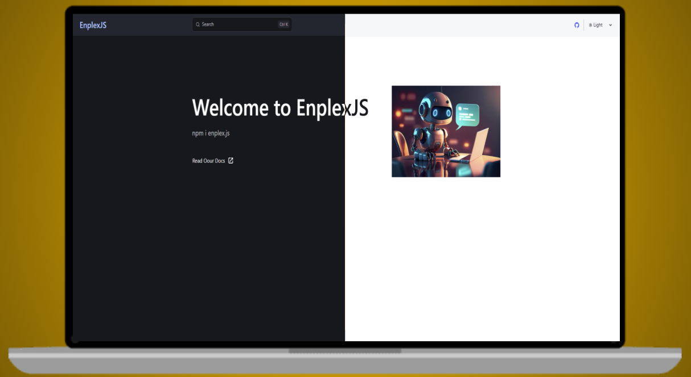
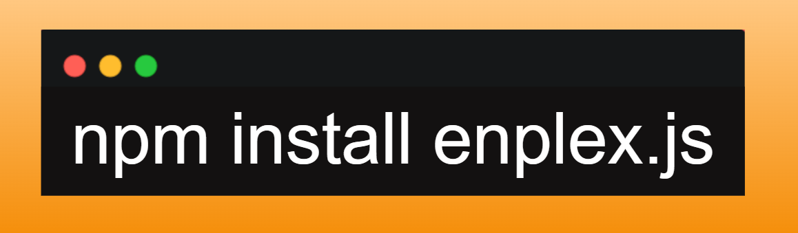

<div align = "center">



## Enplex.js Docs



</div>

## Enplex.js

Enplex.js is a versatile JavaScript library designed to simplify and enhance web development. It provides a unified interface for interacting with various APIs and services, empowering developers to build robust and innovative applications.

- Official [Enplex.js](https://github.com/OpenDevsFlow/EnplexJS) Repository

### Key Features:

* **NextChat:** 
   - Seamless integration with advanced AI models for generating text, images, and upscaling image.
   - Supports a wide range of models, including GPT-4, Claude, and various Llama models.
   - No need for individual API keys.
* **Search:** 
   - Effortless searching across popular platforms like YouTube, Spotify, and GitHub.
* **Random:** 
   - Access to a variety of random content, including cat facts, dog facts, quotes, and anime-related images.
* **DiscordWH:** 
   - Send customized Discord webhook messages with embeds and attachments.
* **Rectify:** 
   - A minimalist framework for building web applications inspired by Express.js.
   - Features include routing, middleware, error handling, and static file serving.
* **Xio:** 
   - A powerful HTTP client for making requests with ease, supporting various HTTP methods, custom headers, timeouts, and retry mechanisms.
* **Executor:** 
   - Safely execute JavaScript code within your applications.
* **Import:** 
   - Import ES modules in CommonJS files.
   - Import CommonJS modules in ESM files.

### Installation

To install Enplex.js, use npm or yarn:

```bash
npm install enplex.js
```

## Documentation Structure:

* **Guides**
   - NextChat
   - Discord Webhook
   - Search
   - Random
   - Rectify
   - Executor
   - Import
   - Xio

* **API**
   - API

## Locally Running:

This website can be locally run on your device through `GIT` & `NodeJS`,

1. Clone the repo using Git:

```bash
git clone https://github.com/OpenDevsFlow/EnplexJS-Docs.git && cd EnplexJS-Docs
```

2. Install all dependencies through NPM:

```bash
npm i
```

3. Start the Development Server:

```bash
npm run dev
```

## Contributing:

- All contributions are welcome and appreciated. Feel free to create an issue or open a pull-request either on this repository or on the offical [EnplexJS](https://github.com/OpenDevsFlow/Enplexjs) repository!

#

> Developed by [OpenDevsFlow](https://github.com/OpenDevsFlow) team!